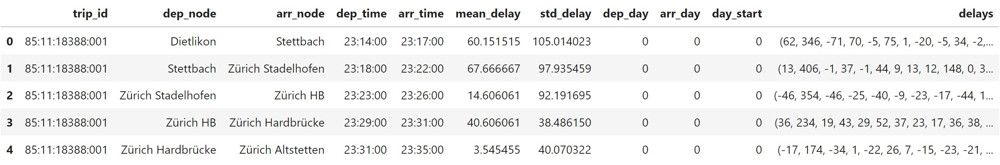
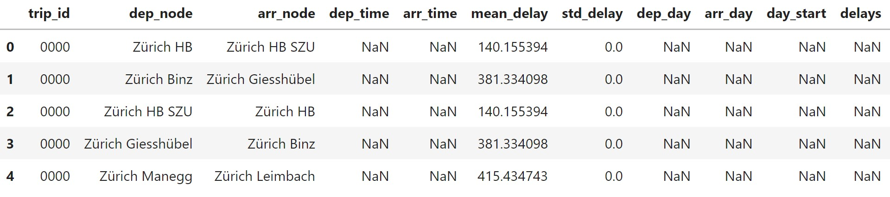
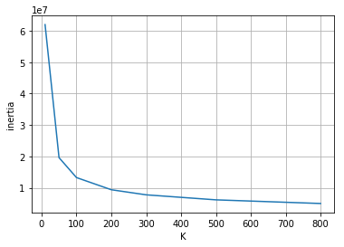
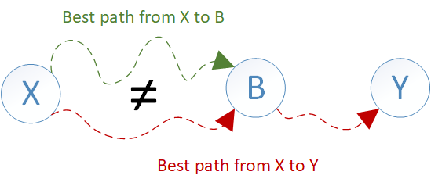

# Robust Journey Planning
Imagine you are a regular user of the public transport system, and you are checking the operator's schedule to meet your friends for a class reunion. The choices are:
1. You could leave in 10mins, and arrive with enough time to spare for gossips before the reunion starts.
2. You could leave now on a different route and arrive just in time for the reunion.

Undoubtedly, if this is the only information available, most of us will opt for 1. If we now tell you that option 1 carries a fifty percent chance of missing a connection and be late for the reunion. Whereas, option 2 is almost guaranteed to take you there on time. Would you still consider option 1? Probably not. However, most public transport applications will insist on the first option. This is because they are programmed to plan routes that offer the shortest travel times, without considering the risk factors.

In this project we have used the SBB dataset (See next section: [Dataset Description](#dataset-description)) to built a public transport route planner to improve on that. In particular, given a desired departure, or arrival time, the route planner computes the fastest route between two stops within a provided uncertainty tolerance. 

## Dataset Description

For this project we have used the data published by the Open Data Platform Swiss Public Transport (<https://opentransportdata.swiss>). The folder contains the actual data [istdaten](<https://opentransportdata.swiss/en/dataset/istdaten>) and the station list data [BFKOORD_GEO](https://opentransportdata.swiss/de/cookbook/hafas-rohdaten-format-hrdf/#Abgrenzung).

The SBB data limited in a range of 10km around the Zurich train station has been used for this project.
## Approach
### 1. Data Cleaning
The source data has been cleaned to obtain all the information regarding the connection edges between the stops, i.e. start_station, arrival_station, the trip the collection belongs to, the departure/arrival times, historical delays (along with mean and std). Here is an example of the obtained dataset, note that there might be many edges between two node A and B:

Walking edges have also been added for closeby stations, and represented as follows:

### 2. Modelling the delay probabilities
Edges have been clustered with KMeans depending on their [20, 30, 40, 50, 60, 70, 80] qth percentiles delays. The elbow method has been used to select the number of clusters:

Edges with similar delays are associated with the same cluster and the delays of each cluster are then represented with a gamma distribution initialized with the mean and standart deviation of the delays of the whole cluster.
We now create a  **distribution**  for each cluster and store them in the schedule. Why?

-   We have few samples per edge which may not be representative enough of its delay distribution.
-   It is reasonable that some edges' delays are dependent. The clusters have hopefully grouped edges whose delays are jointly dependent.

### 3. Implementation of the Journey Planner
#### Problem setup
The  **nodes**  represent the train/bus/metro stations and the  **edges**  the connections between two of them. Each edge is associated with:
-   **departure**  and  **arrival**  **times**  and  **nodes**.
-   a  **continuous distribution**  representing the arrival  **delay**.
-   a  **path id**, identifying the path done by the transport independently from the time of the day.
-   a  **probability**, indicating the probability of taking the whole path up to this edge.

Special edges are the  **walk edges**  which have  **no starting or arrival time nor a delay distribution**  but only a  **fixed walking time**. Two stops usually have either zero or many edges between them representing the different trips done at different times of the day and week.
#### Algorithm
There are two main differences with respect to Dijsktra:
1. **Many edges between two nodes**. The **available edges** depend on the time we can/want to depart from a node. If this was the only difference, i.e. we did not consider any delay distribution, then we could just implement the Dijkstra algorithm with the small variation of always picking the edge between A and B that departs the first given our arrival time at A.
2. **Delay distributions and threshold**. Let's analyze how the probabilities affect the algorithm. Assume we want to find the **best path between node X and Y**. In Dijkstra, if **node B** is on the shortest path between X and Y, then the **best path to B must be part of the best path from X to Y**. However, this does not hold anymore in our journey planning ecosystem because **each path is associated with a probability!**  In particular, it may happen that at B you have to change mean of transport and you also have a high probability of missing the first connection. Therefore, you would have to wait for the next connection. In other words, sometimes is better to arrive a bit later but with the correct mean of transport.

Because of these differecies, we can't know what is the best path to a node if we don't know what we want to do from that node on. Therefore, we decided to implement the algorithm by **visiting and label the edges instead of the nodes**. The algorithm is now much more similar to Dijkstra: we keep a list of visited edges from which we iteratively pick the edge whose arrival time is the lowest and visit all the possible next edges. For each newly visited edge, we compute the probability of taking that connection and prune if the overall probability of the corresponding path falls below the given threshold. However, there are now other differences with respect to Dijkstra that pops up:
-   When considering the set of all the possible next edges we do not keep only the unvisited edges (as would Dijkstra do with nodes). Instead, other than visiting each  **unvisited edge**, we also try to  **improve the probability**  of the already  **visited edges**. This could enable the possibility of proceeding on a path whose probability would otherwise fall below the threshold.
-   We need a way to prune the set of  **the possible next edges**  since considering all the possible next connections that lead to a node would mean that we try to take all the scheduled transports until the end of our days. This pruning is achieved by using the  **path id**  (see section 'Echosystem' for the meaning of this field): we  **group all the edges between A and B by their path id**  and for each group we visit the edges in ascending order of departure time  **until the first edge**  with a connection  **probability high enough**, e.g. in our implementation, higher than 0.99. In this way, we are sure to take at least a transport that does a specific path, and there is obviously no need in trying to take another transport that does the same path and that departs later.
- Since we also have information about the **position** of the nodes (altitude and longitude of the stops), we decided to use it for pruning. In particular, when an explored path goes two times in a row in the wrong direction then we drop it. An edge goes in the wrong direction when the arrival node is farther away from the destination node than the departure node.
-   Our algorithm also manages  **walk edges**, i.e. edges which indicates the possibility of walking to reach the next node. Their usage is a bit different because we have  **no starting or arrival time nor a delay distribution**  but only a  **fixed walking time**. However, the walk edges  **keep the delay distribution of the previous edge**. In fact, the delay distribution of the previous edge clearly affects the time at which we start walking and, therefore, the time at which we will arrive by foot at our destination.

## Conclusion
We firstly modeled the public transport infrastructure as a schedule for the route planning algorithm. Then, we built a regressor that allows the algorithm the estimate the arrival delay to a certain station, at any given time, of any mean of transport. Subsequently, we implemented a route planning algorithm that takes into account the arrival delays in order to compute the fastest path between two stations, given a specific probability threshold (which defines the minimum likeliness of reaching the destination with a certain route). The algorithm has been tested and validated through the reproduction of the algorithm on a smaller dataset. Finally, we implemented a visualization tool in order to visualize the route from a station to another. We also show the isochrone map. These two tools can be used as further doublecheck for the validity of the obtained results.

As a note for improvement on the work that we performed, we can highlight the fact that the algorithm, although it provides reasonable termination times with the current dataset, would probably have a hard time to scale on bigger datasets. However, the provided system still achieves the prefixed goals thanks to a methodology that allowed us to decompose the problem into smaller subproblems and to solve them in order to get the desired results.
